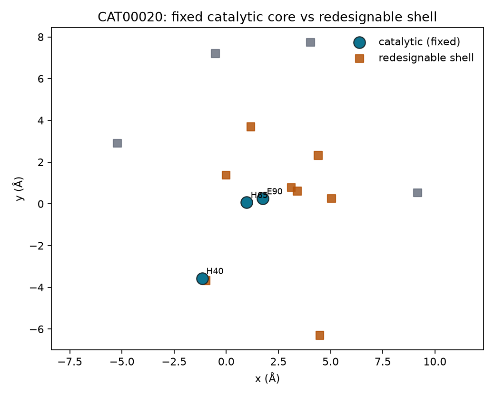
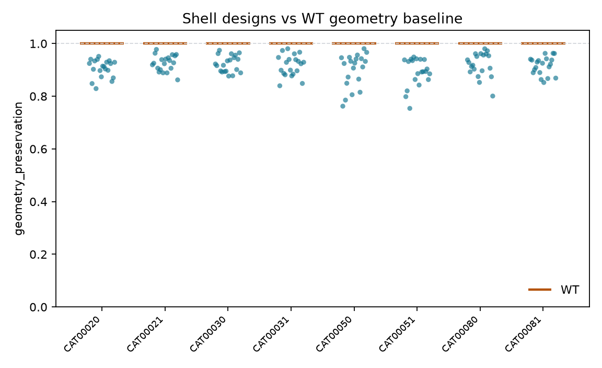

# Catalyst Atlas

**AI-guided redesign of catalytic microenvironments**

*Generative protein design constrained by mechanistic chemistry.*

> Catalytic function is encoded not only by global fold but by local geometric and chemical environments that can be computationally optimized.

[](https://github.com/snowe36/catalyst_atlas/actions/workflows/ci.yml)
[](LICENSE)


Repo: [github.com/snowe36/catalyst_atlas](https://github.com/snowe36/catalyst_atlas)

---

## The question

**Can generative models optimize the molecular environment surrounding known catalytic machinery?**

This is not a claim that AI invented a new enzyme. The workflow keeps **catalytic residues fixed** and redesigns **first-/second-shell** (pocket-shaping) positions — then ranks designs with structure confidence, sequence plausibility, and catalytic geometry / ligand-contact constraints from the atlas.

```text
ProteinMPNN (shell only; catalysts fixed)  →  ~1000 sequences
        │
        ▼
 hard filters + ESM + fixed-backbone chemistry
        │
        ▼
 AF shortlist (WT + top ~5–10 / enzyme ≈ 110 structures)
        │
   ┌────┼────┐
   ▼    ▼    ▼
  AF2  ESM2  catalytic geometry / ligand contacts
   └────┼────┘
        ▼
 chemistry_preservation_score  (vs WT baseline)
        │
        ▼
 optional MD deep-dive (1–2 top pairs)
```

The portfolio story is a **chemistry-constrained design funnel** (1000 → ~100 AF jobs), not “predict every design.”

| Piece | Role |
|-------|------|
| Pocket artifact | Catalytic (fixed) + redesignable shell with chain/resnum/aa/xyz |
| Generator | ProteinMPNN adapter (or mock / FASTA import) — swappable |
| Evaluation | AF metrics + ESM neighborhood + catalytic geometry proxies |
| Score | `chemistry_preservation_score` = 0.4 geometry + 0.3 structure + 0.3 ESM |

Hard invariants: designed sequence matches WT at catalytic indices; every mutation lies in the redesignable set.

```bash
cat-download --demo
cat-design-run --panel-size 10 --n-sequences 100 --mock
```

Case study writeup: [`reports/design_case_study.md`](reports/design_case_study.md) · plan: [`docs/plans/v0.6_generative_design.md`](docs/plans/v0.6_generative_design.md).

<p align="center">
  
</p>

<p align="center"><em>Fixed catalytic core vs redesignable first-/second-shell positions.</em></p>

<p align="center">
  
</p>

<p align="center"><em>Designs scored relative to a WT baseline — improved vs worse geometry preservation.</em></p>

---

## What this repo builds

1. **Curate** M-CSA catalytic sites with structures, cofactors, and chemistry labels
2. **Define** pocket artifacts (fixed catalysts + redesignable shells)
3. **Generate** shell-only sequence designs (ProteinMPNN or import)
4. **Score** designs vs WT with AF / ESM / catalytic geometry proxies
5. **Validate** learned catalytic representations under leakage-aware holdouts (below)

---

## Validation of learned catalytic representations

Evolutionary similarity is a strong proxy for function when homologs exist. The supporting benchmark asks what remains when they do not — chemistry identification from the reaction center under sequence/fold holdouts.

Primary metric: `fold_cluster` chemistry accuracy on the expanded atlas (**n=1157**; M-CSA 959 + UniProt 198).

Multi-seed bake-off (seeds 7 / 11 / 13):

| Method | fold_cluster (mean ± std) |
|--------|--------------------------:|
| Engineered microenvironment | 0.40 ± 0.02 |
| ESM-2 | 0.40 ± 0.06 |
| ESM+GNN | 0.42 ± 0.06 |

Neighborhood baselines (seed 7): MMseqs2 0.04, Foldseek 0.13. Random-graph ablation: geometry-specific gains are **not yet established**. Sources: [`reports/v05_seed_summary.json`](reports/v05_seed_summary.json), [`reports/v05_ablation_summary.json`](reports/v05_ablation_summary.json).

<p align="center">
  
</p>

### Convergent chemistry (representation evidence)

| | Thermolysin `MCSA00176` | Neprilysin `MCSA00623` |
|--|-------------------------|-------------------------|
| Sequence neighborhood | remote (~5–7% k-mer Jaccard) | remote |
| Fold / CATH | `1.10.390` | `3.40.390` |
| Reaction chemistry | hydrolysis / metal activation | hydrolysis / metal activation |

Full writeup: [`reports/hero_convergent_chemistry.md`](reports/hero_convergent_chemistry.md).

<p align="center">
  
</p>

<p align="center"><em>Representation pipeline used to validate catalytic microenvironment features.</em></p>

### Example output

```bash
cat-search --enzyme-id MCSA00176
```

```text
Catalyst Atlas
==============

Chemistry: hydrolysis (metal activation)
Confidence: 0.82

Evidence:
  - catalytic residue pattern: His-Glu-Asp-Arg
  - mechanistic pattern: metal activation
  - Zn cofactor/metal at reaction center
  - analogs span multiple fold neighborhoods

Nearest analogs:
  1. MCSA00623 — hydrolysis / metal activation (cof=Zn; different fold)
  2. MCSA00159 — hydrolysis / metal activation (cof=Zn; different fold)
  ...
```

The artifact is **prediction + why** — chemistry family, mechanistic pattern, and catalytic evidence — not `score = 0.82`.

---

## Key results

| Check | Result |
|-------|--------|
| Expanded atlas sites (M-CSA + UniProt) | **1157** |
| Fold-disconnected Catalyst / MMseqs / Foldseek | **0.37** / 0.04 / 0.13 |
| Chemistry Recall@5 (fold_cluster) | **0.67** |
| Chemistry MRR (fold_cluster) | **0.46** |
| MMseqs2 at nearest-train identity **<20%** | **0.00** |
| Different-fold / same-chemistry | Catalyst **0.50** vs Foldseek **0.04** — **informative audit, n=26** |
| Same-fold / different-chemistry | Foldseek **0.51** vs Catalyst 0.39 (**n=131**) — fold info is legitimately useful |

> **Key observation:** when enzymes share chemistry but not fold, standard sequence/structure retrieval can fail; interpretable reaction-center representations provide a complementary signal.

The fold-disconnected benchmark (**n=461** test) carries the quantitative claim. The convergent-chemistry subset (**n=26**) is a biologically informative hard audit — not the primary win metric. Do not oversell it.

Full writeup: [`reports/mcsa_v02_n959_results.md`](reports/mcsa_v02_n959_results.md).

---

## Quick start

Requires **Python 3.11+**:

```bash
git clone https://github.com/snowe36/catalyst_atlas.git && cd catalyst_atlas
python3.11 -m venv .venv && source .venv/bin/activate
pip install -U pip && pip install -e ".[dev]"
bash scripts/reproduce.sh && pytest -q
```

```text
# Redesign case study (offline mock OK)
cat-download → cat-design-run

# Representation validation track
cat-download → cat-enrich → cat-sites → cat-embed → cat-eval → cat-cases → cat-figures
```

Optional: **MMseqs2** / **Foldseek** on `PATH` for retrieval baselines; ProteinMPNN / ColabFold externally for real designs (see [`docs/plans/v0.6_generative_design.md`](docs/plans/v0.6_generative_design.md)).

---

## Figure 2 — Chemistry transfer under evolutionary distance

At high identity, sequence is the right tool. At remote homology, sequence transfer becomes unreliable; the catalytic environment retains chemically relevant signal.

| Nearest train identity | n | Catalyst | MMseqs2 | Foldseek |
|------------------------|--:|---------:|--------:|---------:|
| >80% | 3 | 0.67 | 0.33 | 0.67 |
| 40–80% | 14 | 0.50 | **0.86** | 0.71 |
| 20–40% | 61 | 0.56 | 0.64 | **0.67** |
| <20% | 154 | **0.45** | 0.00 | 0.27 |

<p align="center">
  
</p>

<p align="center"><em>Figure 2. Expanded atlas (n=1157, random split). MMseqs2 is strong in the mid-identity band and collapses below 20%; engineered microenvironments keep signal when homologs are gone. High-identity bins are small-n.</em></p>

Leakage-aware splits (expanded atlas):

| Split | Catalyst | ESM-2 | ESM+GNN | MMseqs2 | Foldseek |
|-------|---------:|------:|--------:|--------:|---------:|
| Random | 0.48 | 0.60 | **0.79** | 0.22 | 0.41 |
| Seq cluster | 0.45 | 0.59 | **0.77** | 0.22 | 0.40 |
| Fold cluster (seed 7) | 0.38 | 0.46 | **0.49** | 0.04 | 0.13 |

Fold-cluster numbers above are the seed-7 run. Multi-seed means: engineered 0.40 ± 0.02, ESM-2 0.40 ± 0.06, ESM+GNN 0.42 ± 0.06.

Recall@5 / MRR ask: does the true chemistry appear among retrieved catalytic neighbors? Accuracy alone understates a retrieval system.

---

## Figure 3 — Fold and chemistry are separable

| Panel | Question | n | Catalyst | Foldseek | MMseqs2 |
|-------|----------|--:|---------:|---------:|--------:|
| **A** Same fold, different chemistry | Avoid false functional transfer? | 131 | 0.39 | **0.51** | 0.26 |
| **B** Different fold, same chemistry | Recognize convergent chemistry? | **26** | **0.50** | 0.04 | 0.08 |

<p align="center">
  
</p>

<p align="center"><em>Figure 3. Panel A: fold information is legitimately useful — leave it visible. Panel B (n=26): chemistry can be conserved despite different evolutionary solutions.</em></p>

---

## Figure 4 — Evidence cards

The practical output is a **chemistry card**: family, mechanistic pattern, catalytic evidence, and nearest chemical analogs — not just a leaderboard number.

<p align="center">
  
</p>

<p align="center"><em>Figure 4. Prediction + mechanistic evidence — the thing a scientist would actually use.</em></p>

Narrative case studies: `cat-cases` → [`reports/case_studies/`](reports/case_studies/).

---

## Catalytic microenvironment

| Component | Detail |
|-----------|--------|
| Source | [M-CSA](https://www.ebi.ac.uk/thornton-srv/m-csa/) + [RCSB PDB](https://www.rcsb.org/) |
| Catalytic residues | Annotated chemistry-participating amino acids |
| Geometry | Pairwise distances among catalytic atoms |
| Cofactors / metals | HETATM within ~8 Å of the catalytic core |
| First shell | Neighboring residues around the site |
| Labels | `chemistry_family` + `mechanistic_pattern` |

<p align="center">
  
</p>

<p align="center"><em>Zn-activation reaction center — a local chemical machine, not a fold fingerprint.</em></p>

---

## Data

| Item | Detail |
|------|--------|
| M-CSA curated sites | **959** |
| Additional UniProt ACT_SITE sites | **198** |
| Expanded atlas sites | **1157** |
| Structures | [RCSB PDB](https://www.rcsb.org/) + AFDB (`structure_source=alphafold` where used) |
| With site cofactors / metals (M-CSA track) | **324** |
| Convergent-chemistry audit subset | **26–29** (hard; informative, not large) |
| Demo atlas | CI harness (`cat-download --demo`) |

---

## Limitations

- Expanded atlas is still curated-scale (n=1157), not proteome-wide
- Fold-cluster scores are **split-sensitive** (ESM-2 and ESM+GNN both move ±0.06 across three seeds)
- Random-graph ablation: geometry-specific gains are **not yet established** (shuffled nodes ≥ catalytic graphs on seed 7)
- Convergent-chemistry audit is small (**n≈26–29**) — useful, not decisive
- Labels are ontology families / patterns, not full kinetic schemes
- Chemistry cards cite pattern / cofactor / fold-span evidence — not full mechanistic checklists

---

## Versions / thesis

Catalyst Atlas is an AI-guided enzyme redesign workflow that preserves mechanistic chemistry while exploring shell sequence space. Learned catalytic representations (leakage-aware holdouts) support the scoring features; they are not the product claim.

| Version | Claim |
|---------|--------|
| v0.2 | Catalytic microenvironments contain chemistry signal under fold holdout |
| v0.3 | Learned representations require leakage-aware evaluation |
| v0.4 | Expanded atlas + controls separate chemistry from annotation shortcuts |
| v0.5 | ESM+GNN can improve a fold holdout on individual splits; multi-seed / random-graph controls limit geometry claims |
| v0.6 | Shell redesign with fixed catalysts + `chemistry_preservation_score` vs WT |

| Step | Command | Role |
|------|---------|------|
| Reaction-center graphs | `cat-graphs` | Explicit catalytic-machine graphs |
| Frozen ESM-2 | `cat-esm` | Sequence foundation-model control |
| ESM + GNN fusion | `cat-train-encoder --fusion-esm` | Sequence + local structure |
| Annotation controls | `cat-eval` | Same-residue / same-cofactor / shuffled shell / decoy |
| Expanded atlas | `cat-download --public --expanded` | UniProt ACT_SITE + EC; AFDB as `structure_source=alphafold` |
| Multi-seed bake-off | `scripts/v05_seed_bakeoff.py` / `v05_parallel_bakeoff.py` | Split variance |
| Random-graph ablation | `scripts/v05_ablation_run.py` | Geometry vs capacity control |

Design plan: [`v0.6`](docs/plans/v0.6_generative_design.md). Representation summaries: [`v05_seed`](reports/v05_seed_summary.json), [`v05_ablation`](reports/v05_ablation_summary.json). Earlier plans: [`v0.3`](docs/plans/v0.3_learn_catalytic_language.md), [`v0.4`](docs/plans/v0.4_rigor_and_scale.md), [`v0.5`](docs/plans/v0.5_expanded_learned.md).

Out of scope: full-atlas ProteinMPNN, new generative model training, generator bake-offs, wet-lab validation claims.

---

## How to reproduce

```bash
git clone https://github.com/snowe36/catalyst_atlas.git
cd catalyst_atlas
python3.11 -m venv .venv && source .venv/bin/activate
pip install -U pip && pip install -e ".[dev]"
bash scripts/reproduce.sh
pytest -q
```

Real curated sites:

```bash
cat-download --public --n-enzymes 1000
cat-enrich
cat-sites && cat-embed && cat-eval
cat-cases && cat-figures
cat-search --enzyme-id MCSA00176
```

| Artifact | Path |
|----------|------|
| Design case study | `reports/design_case_study.md` |
| Design pocket map | `reports/figures/fig_design_pocket_map.png` |
| Design geometry vs WT | `reports/figures/fig_design_geometry_vs_wt.png` |
| Design score scatter | `reports/figures/fig_design_score_scatter.png` |
| Fig 1 representation pipeline | `reports/figures/fig1_pipeline.png` |
| Fig 2 identity stratification | `reports/figures/fig_chemistry_by_seq_identity.png` |
| Fig 3 fold–chemistry audits | `reports/figures/fig_fold_chemistry_audits.png` |
| Fig 4 chemistry cards | `reports/figures/fig4_chemistry_cards.png` |
| Convergent case study | `reports/hero_convergent_chemistry.md` |
| Seed / ablation summaries | `reports/v05_seed_summary.json`, `reports/v05_ablation_summary.json` |

---

## Project layout

```text
src/catalyst_atlas/
  design/             pocket, panel, generate, mpnn, predict, score, report
  data/ site/ featurize/ models/ eval/ explain/ viz/
scripts/              reproduce.sh, embed_esm.py, runpod_train.sh
docs/plans/           v0.3–v0.6 (design case study in v0.6)
data/processed/design/ pockets, designs, scores, mpnn_jobs
reports/              design_case_study.md + figures
tests/                unit + design invariants + pipeline smoke
```

---

## Acknowledgments

Catalytic site annotations from [M-CSA](https://www.ebi.ac.uk/thornton-srv/m-csa/) (EMBL-EBI / Thornton group). Structures from the [RCSB PDB](https://www.rcsb.org/).

---

## AI Assistance

Development of this repository was assisted by Cursor (AI-powered code editor) for code generation, refactoring, documentation, and routine implementation tasks. All scientific design, algorithmic decisions, validation, testing, and final code review were performed by the author.

---

## License

MIT
