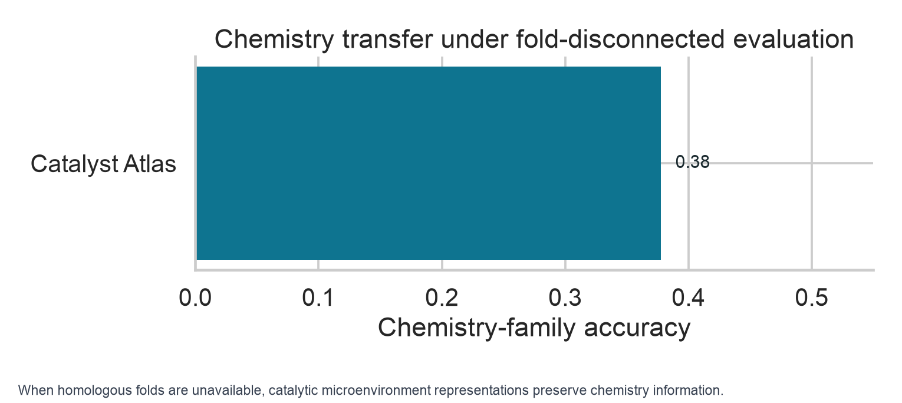
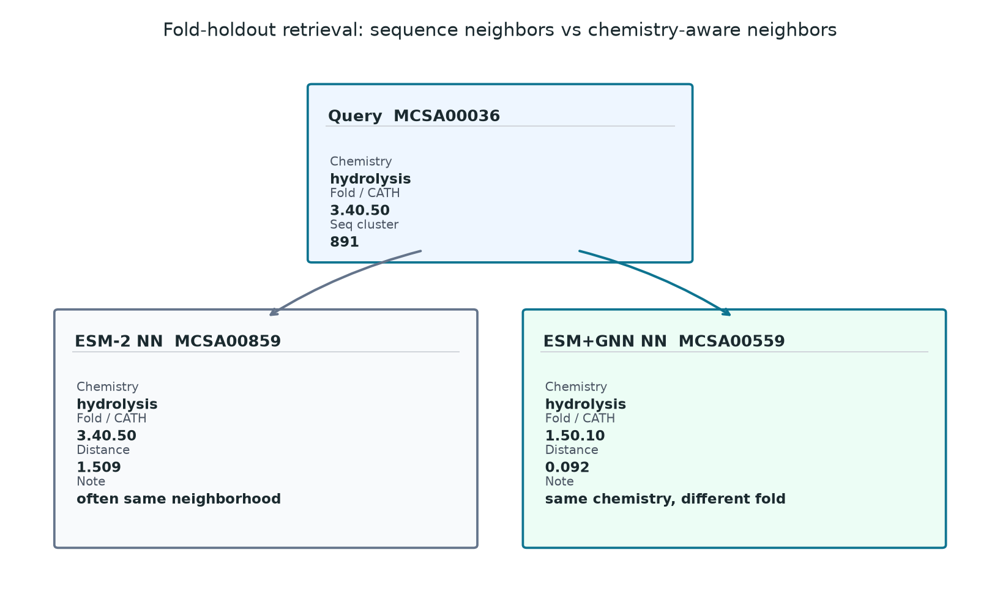
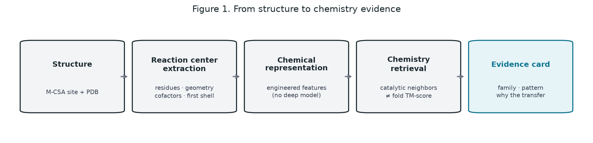
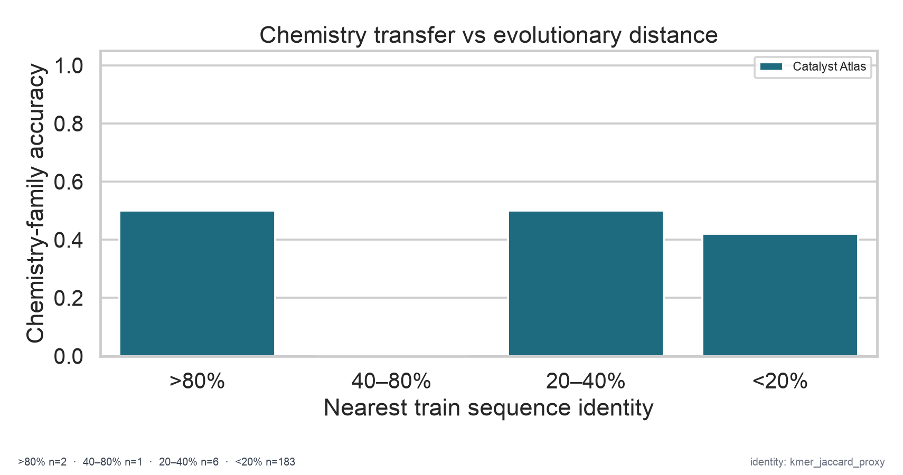
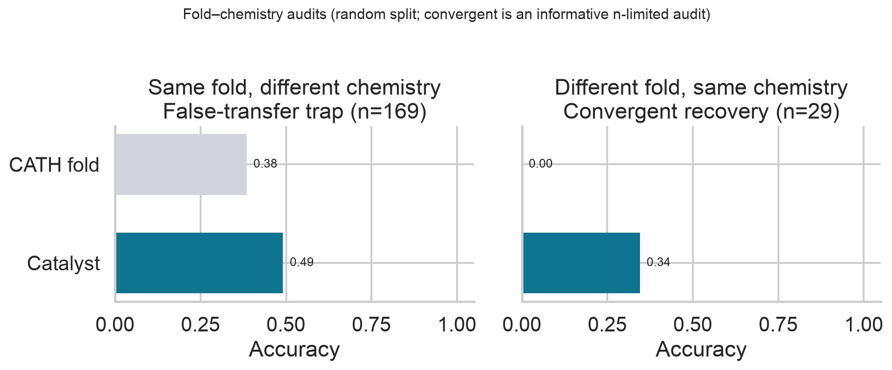
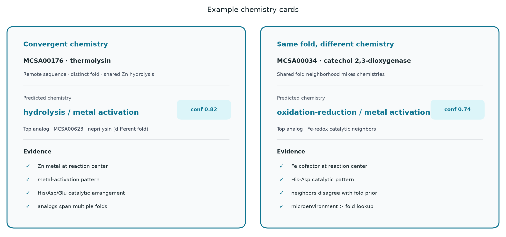
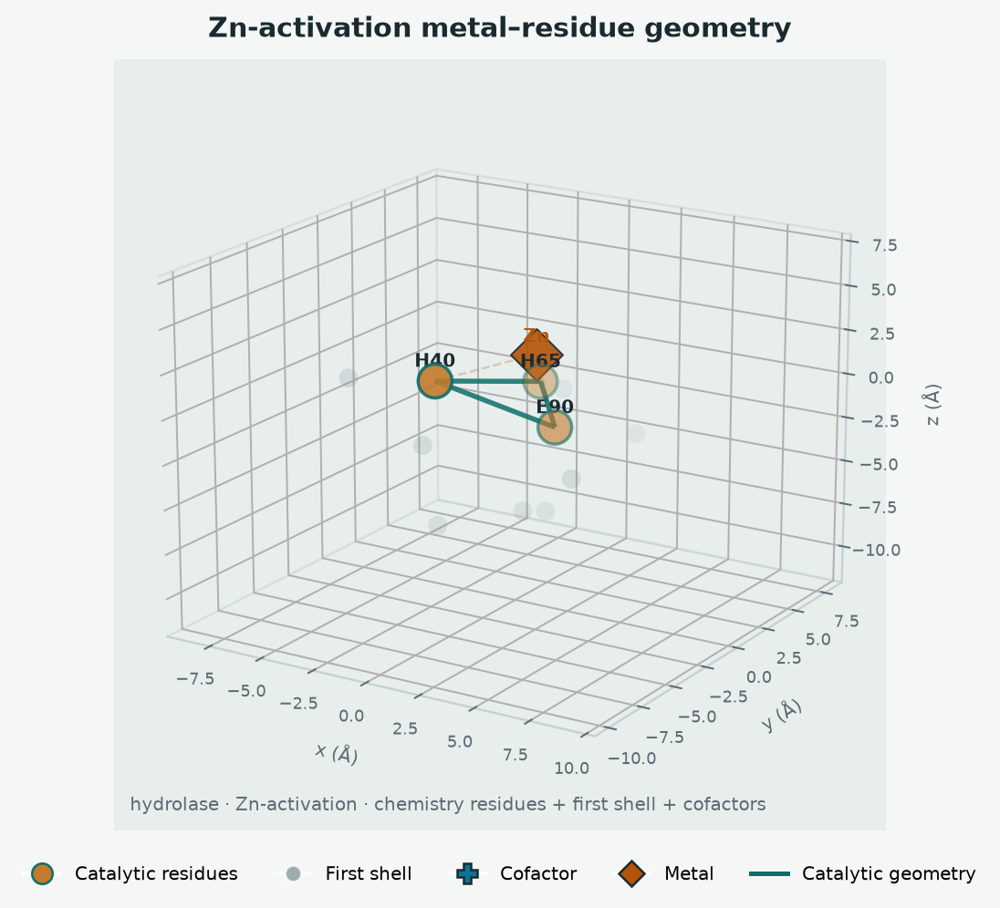

# catalyst_atlas

**A leakage-aware benchmark for chemistry identification from catalytic microenvironments** — ask what chemistry a protein site supports from its reaction center, then stress-test whether that signal survives when sequence and fold neighbors are held out.

> *Ask a protein what chemistry it can do — not what it looks like.*

[](https://github.com/snowe36/catalyst_atlas/actions/workflows/ci.yml)
[](LICENSE)


Repo: [github.com/snowe36/catalyst_atlas](https://github.com/snowe36/catalyst_atlas)

---

## The problem

Evolutionary similarity is a strong proxy for function when homologs exist. The harder question is what remains when they do not:

**Can we identify what catalytic transformation a protein site is equipped to perform from its microenvironment — and how much of that apparent skill is really neighborhood leakage rather than chemistry-aware signal?**

This is an evaluation-hygiene / representation problem with explicit negative controls (sequence-cluster and fold-cluster holdouts). The claim is **not** “we beat Foldseek.” Foldseek is excellent when fold neighbors are available. Catalytic representations become valuable when chemistry is conserved independently of sequence and fold.

---

## The key experiment: remove evolutionary neighborhoods

**Can a model identify catalytic chemistry when sequence/fold neighbors are removed?**

Primary metric: `fold_cluster` chemistry accuracy on the expanded atlas (**n=1157**; M-CSA 959 + UniProt 198).

| Method | fold_cluster accuracy |
|--------|----------------------:|
| MMseqs2 | 0.04 |
| Foldseek | 0.13 |
| Engineered catalytic microenvironment | 0.38 |
| ESM-2 (frozen sequence) | 0.46 |
| **ESM+GNN** (sequence + reaction-center structure) | **0.49** |

A learned representation that combines evolutionary-scale sequence information with local catalytic geometry captures chemistry-transfer signal beyond either alone. The gain over ESM-2 is modest (+0.03) — the GNN is adding local chemical context, not replacing the foundation model.

How the pieces read together:

| Representation | fold_cluster | Reading |
|----------------|-------------:|---------|
| GNN alone (reaction-center graphs) | ~0.32 | Learning chemistry from local graphs alone is hard at n≈1000 |
| ESM-2 | 0.46 | Sequence models already encode substantial biochemical information |
| ESM+GNN | **0.49** | The catalytic microenvironment adds signal sequence alone does not fully capture |

Neighborhood baselines (MMseqs / Foldseek) collapse under fold holdout; engineered microenvironments stay competitive and interpretable. Prior MCSA-only track (n=959): ESM+GNN 0.45 — see [`docs/plans/v0.3_learn_catalytic_language.md`](docs/plans/v0.3_learn_catalytic_language.md).

On a small convergent-chemistry audit (**n=29**), ESM+GNN retrieves cross-fold chemical analogs with high accuracy (0.83), suggesting improved sensitivity to chemistry conserved across divergent evolutionary solutions. That subset is hypothesis-generating, not the primary benchmark.

Annotation-style controls (same-residue / same-cofactor / shuffled shell / decoy centers) are in `cat-eval` — figure [`reports/figures/fig_annotation_style_controls.png`](reports/figures/fig_annotation_style_controls.png).

<p align="center">
  
</p>

<p align="center">
  
</p>

<p align="center"><em>ESM-2 often retrieves a sequence/fold neighbor; ESM+GNN more often surfaces same chemistry across folds.</em></p>

---

## Case study: convergent chemistry across unrelated folds

A fold-disconnected pair with shared chemistry recovered by reaction-center similarity — what the representation encodes, not a blind discovery claim.

| | Thermolysin `MCSA00176` | Neprilysin `MCSA00623` |
|--|-------------------------|-------------------------|
| Sequence neighborhood | remote (~5–7% k-mer Jaccard) | remote |
| Fold / CATH | `1.10.390` | `3.40.390` |
| Reaction chemistry | hydrolysis / metal activation | hydrolysis / metal activation |
| Catalyst Atlas | ranks neprilysin among top catalytic neighbors | — |

**Why:** shared reaction-center geometry · Zn cofactor environment · His/Asp/Glu catalytic arrangement — not fold TM-score.

Full writeup: [`reports/hero_convergent_chemistry.md`](reports/hero_convergent_chemistry.md).

---

## What this repo builds

1. **Download & curate** M-CSA catalytic sites with RCSB coordinates
2. **Extract** catalytic microenvironments (residues, geometry, cofactors, first shell)
3. **Represent** chemistry with engineered reaction-center features
4. **Retrieve** catalytic neighbors under leakage-aware splits
5. **Explain** with evidence cards — prediction + mechanistic evidence, not a score alone

<p align="center">
  
</p>

<p align="center"><em>Figure 1. From structure to chemistry evidence — microenvironment retrieval, not fold search.</em></p>

### Example output

```bash
cat-search --enzyme-id MCSA00176
```

```text
Catalyst Atlas
==============

Chemistry: hydrolysis (metal activation)
Confidence: 0.82

Evidence:
  - catalytic residue pattern: His-Glu-Asp-Arg
  - mechanistic pattern: metal activation
  - Zn cofactor/metal at reaction center
  - analogs span multiple fold neighborhoods

Nearest analogs:
  1. MCSA00623 — hydrolysis / metal activation (cof=Zn; different fold)
  2. MCSA00159 — hydrolysis / metal activation (cof=Zn; different fold)
  ...
```

The artifact is **prediction + why** — chemistry family, mechanistic pattern, and catalytic evidence — not `score = 0.82`.

---

## Key results

| Check | Result |
|-------|--------|
| Curated catalytic sites (M-CSA v1) | **959** |
| Fold-disconnected Catalyst / MMseqs / Foldseek | **0.37** / 0.04 / 0.13 |
| Chemistry Recall@5 (fold_cluster) | **0.67** |
| Chemistry MRR (fold_cluster) | **0.46** |
| MMseqs2 at nearest-train identity **<20%** | **0.00** |
| Different-fold / same-chemistry | Catalyst **0.50** vs Foldseek **0.04** — **informative audit, n=26** |
| Same-fold / different-chemistry | Foldseek **0.51** vs Catalyst 0.39 (**n=131**) — fold info is legitimately useful |

> **Key observation:** when enzymes share chemistry but not fold, structure retrieval fails while reaction-center representations retain signal.

The fold-disconnected benchmark (**n=461** test) carries the quantitative claim. The convergent-chemistry subset (**n=26**) is a biologically informative hard audit — not the primary win metric. Do not oversell it.

Full writeup: [`reports/mcsa_v02_n959_results.md`](reports/mcsa_v02_n959_results.md).

---

## Quick start

Requires **Python 3.11+**:

```bash
git clone https://github.com/snowe36/catalyst_atlas.git && cd catalyst_atlas
python3.11 -m venv .venv && source .venv/bin/activate
pip install -U pip && pip install -e ".[dev]"
bash scripts/reproduce.sh && pytest -q
```

```text
cat-download → cat-enrich → cat-sites → cat-embed → cat-eval → cat-cases → cat-figures
```

Optional: **MMseqs2** / **Foldseek** on `PATH` (or vendored under `tools/`) for live retrieval baselines.

---

## Figure 2 — Chemistry transfer under evolutionary distance

At high identity, sequence is the right tool. At remote homology, sequence transfer becomes unreliable; the catalytic environment retains chemically relevant signal.

| Nearest train identity | n | Catalyst | MMseqs2 | Foldseek |
|------------------------|--:|---------:|--------:|---------:|
| >80% | 2 | 0.50 | **1.00** | 0.00 |
| 40–80% | 16 | 0.62 | 0.69 | **0.75** |
| 20–40% | 60 | 0.50 | **0.70** | 0.68 |
| <20% | 114 | 0.35 | **0.00** | 0.38 |

<p align="center">
  
</p>

<p align="center"><em>Figure 2. Not a strawman: MMseqs2 wins near homologs and collapses below 20% identity.</em></p>

Leakage-aware splits + retrieval metrics:

| Split | Catalyst acc. | MMseqs2 | Foldseek | Recall@5 | MRR |
|-------|--------------:|--------:|---------:|---------:|----:|
| Random | 0.42 | 0.29 | **0.50** | 0.72 | 0.54 |
| Seq cluster | 0.42 | 0.23 | **0.49** | 0.72 | 0.51 |
| Fold cluster | **0.37** | 0.04 | 0.13 | **0.67** | **0.46** |

Recall@5 / MRR ask: does the true chemistry appear among retrieved catalytic neighbors? Accuracy alone understates a retrieval system.

---

## Figure 3 — Fold and chemistry are separable

| Panel | Question | n | Catalyst | Foldseek | MMseqs2 |
|-------|----------|--:|---------:|---------:|--------:|
| **A** Same fold, different chemistry | Avoid false functional transfer? | 131 | 0.39 | **0.51** | 0.26 |
| **B** Different fold, same chemistry | Recognize convergent chemistry? | **26** | **0.50** | 0.04 | 0.08 |

<p align="center">
  
</p>

<p align="center"><em>Figure 3. Panel A: fold information is legitimately useful — leave it visible. Panel B (n=26): chemistry can be conserved despite different evolutionary solutions.</em></p>

---

## Figure 4 — Evidence cards

Most protein AI repos end at a score. The deliverable here is a **chemistry card**: family, mechanistic pattern, catalytic evidence, and nearest chemical analogs.

<p align="center">
  
</p>

<p align="center"><em>Figure 4. Prediction + mechanistic evidence — the thing a scientist would actually use.</em></p>

Narrative case studies: `cat-cases` → [`reports/case_studies/`](reports/case_studies/).

---

## Catalytic microenvironment

| Component | Detail |
|-----------|--------|
| Source | [M-CSA](https://www.ebi.ac.uk/thornton-srv/m-csa/) + [RCSB PDB](https://www.rcsb.org/) |
| Catalytic residues | Annotated chemistry-participating amino acids |
| Geometry | Pairwise distances among catalytic atoms |
| Cofactors / metals | HETATM within ~8 Å of the catalytic core |
| First shell | Neighboring residues around the site |
| Labels | `chemistry_family` + `mechanistic_pattern` |

<p align="center">
  
</p>

<p align="center"><em>Zn-activation reaction center — a local chemical machine, not a fold fingerprint.</em></p>

---

## Data

| Item | Detail |
|------|--------|
| Source | [M-CSA](https://www.ebi.ac.uk/thornton-srv/m-csa/) |
| Structures | [RCSB PDB](https://www.rcsb.org/) (`data/raw/mcsa_cache/pdb`) |
| Enzymes / sites | **959** |
| With site cofactors / metals | **324** |
| Convergent-chemistry audit subset | **26** (hard; informative, not large) |
| Demo atlas | CI harness (`cat-download --demo`) |

---

## Limitations

- M-CSA is curated and relatively small; not a proteome-scale claim
- Convergent-chemistry audit is **n=26** — biologically on-point, statistically modest
- Labels are ontology families / patterns, not full kinetic schemes
- Chemistry cards cite pattern / cofactor / fold-span evidence — not yet full mechanistic feature checklists
- Deep models deferred until they beat this engineered baseline on hard holdouts

---

## Versions / thesis

| Version | Claim |
|---------|--------|
| v0.2 | Catalytic microenvironments contain chemistry signal under fold holdout |
| v0.3 | Learned representations require leakage-aware evaluation |
| v0.4 | Expanded atlas + controls separate chemistry from annotation shortcuts |
| v0.5 | ESM+GNN combines sequence-scale and reaction-center representations to improve fold-disconnected chemistry transfer |

| Step | Command | Role |
|------|---------|------|
| Reaction-center graphs | `cat-graphs` | Explicit catalytic-machine graphs |
| Frozen ESM-2 | `cat-esm` | Sequence foundation-model control |
| ESM + GNN fusion | `cat-train-encoder --fusion-esm` | Sequence + local structure |
| Annotation controls | `cat-eval` | Same-residue / same-cofactor / shuffled shell / decoy |
| Expanded atlas | `cat-download --public --expanded` | UniProt ACT_SITE + EC; AFDB as `structure_source=alphafold` |
| Multi-seed / graph ablation | `scripts/v05_seed_bakeoff.py` | Variance + random-graph control |

Lead metric: **`fold_cluster`**. Summary: [`reports/v04_reeval_summary.json`](reports/v04_reeval_summary.json). Plans: [`v0.3`](docs/plans/v0.3_learn_catalytic_language.md), [`v0.4`](docs/plans/v0.4_rigor_and_scale.md), [`v0.5`](docs/plans/v0.5_expanded_learned.md).

Out of scope for now: ESM fine-tuning, hard-negative mining, multi-task heads, optimizing random-split accuracy.

---

## How to reproduce

```bash
git clone https://github.com/snowe36/catalyst_atlas.git
cd catalyst_atlas
python3.11 -m venv .venv && source .venv/bin/activate
pip install -U pip && pip install -e ".[dev]"
bash scripts/reproduce.sh
pytest -q
```

Real curated sites:

```bash
cat-download --public --n-enzymes 1000
cat-enrich
cat-sites && cat-embed && cat-eval
cat-cases && cat-figures
cat-search --enzyme-id MCSA00176
```

| Artifact | Path |
|----------|------|
| Fig 1 pipeline | `reports/figures/fig1_pipeline.png` |
| Fig 2 identity stratification | `reports/figures/fig_chemistry_by_seq_identity.png` |
| Fig 3 fold–chemistry audits | `reports/figures/fig_fold_chemistry_audits.png` |
| Fig 4 chemistry cards | `reports/figures/fig4_chemistry_cards.png` |
| Retrieval neighbors | `reports/figures/fig_retrieval_neighbors.png` |
| Annotation controls | `reports/figures/fig_annotation_style_controls.png` |
| Convergent case study | `reports/hero_convergent_chemistry.md` |
| Metrics | `data/processed/eval_metrics.json` |
| Seed / ablation summaries | `reports/v05_seed_summary.json`, `reports/v05_ablation_summary.json` |

---

## Project layout

```text
src/catalyst_atlas/   package (data, site, featurize, models, eval, explain, viz)
scripts/              reproduce.sh, embed_esm.py, runpod_train.sh
docs/plans/           v0.3 bake-off + v0.4 rigor/scale plans
data/raw|processed/   M-CSA / PDB cache + features, graphs, embeddings, metrics
artifacts/            trained encoder checkpoints (gitignored)
reports/figures/      Fig 1–4 + microenvironment panels
reports/case_studies/ three scientific narratives
tests/                unit + pipeline smoke tests
.github/workflows/    CI (ruff + pytest; GPU optional)
```

---

## Acknowledgments

Catalytic site annotations from [M-CSA](https://www.ebi.ac.uk/thornton-srv/m-csa/) (EMBL-EBI / Thornton group). Structures from the [RCSB PDB](https://www.rcsb.org/).

---

## License

MIT
