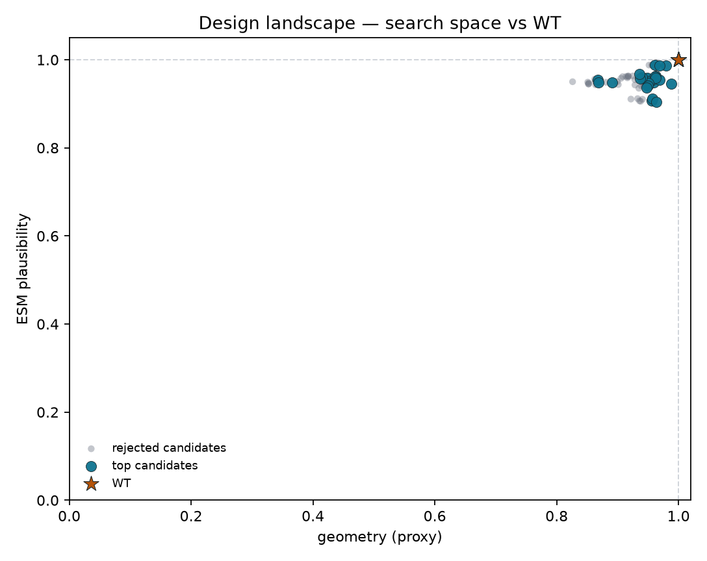
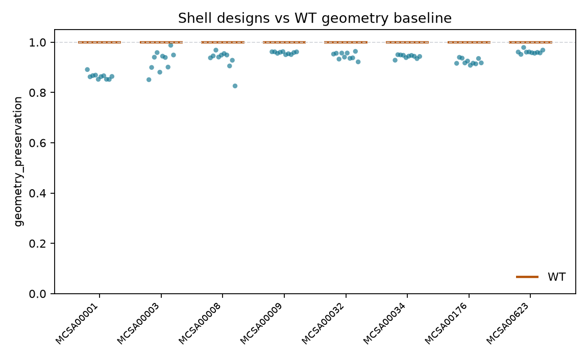
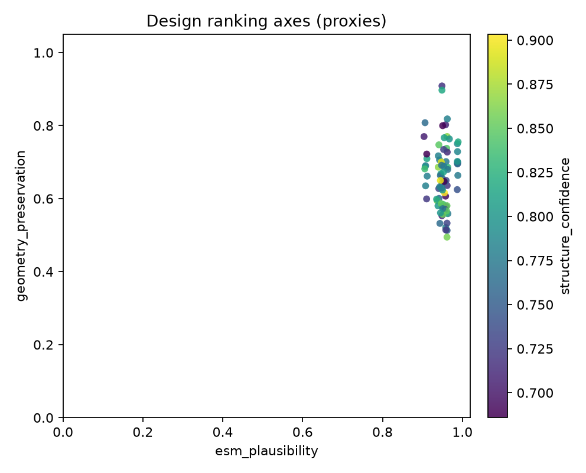
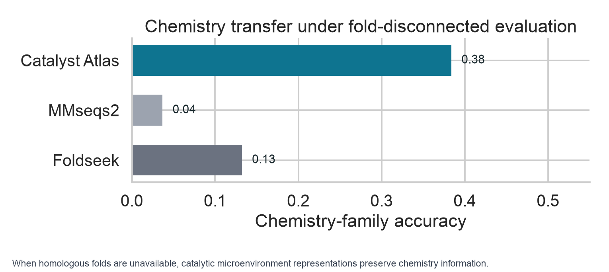
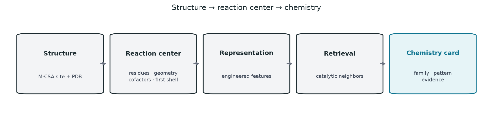
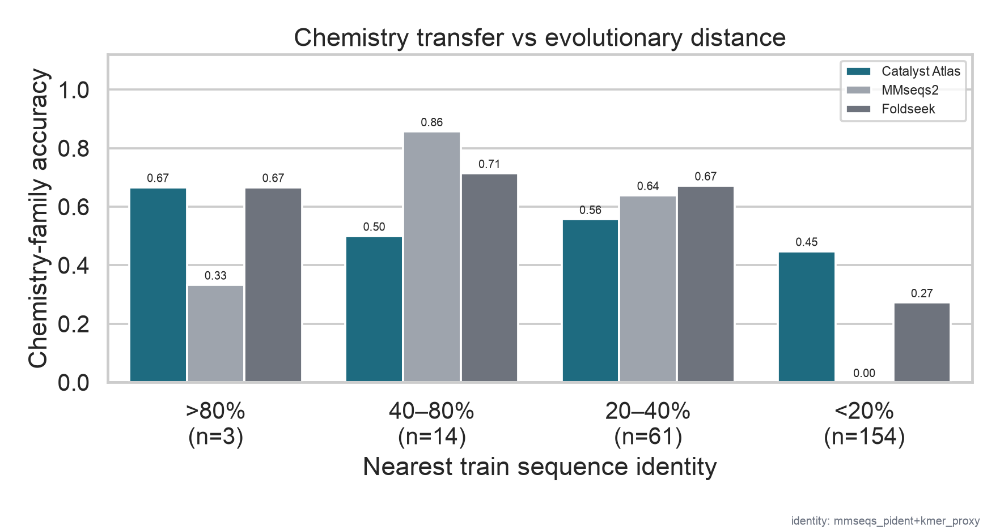
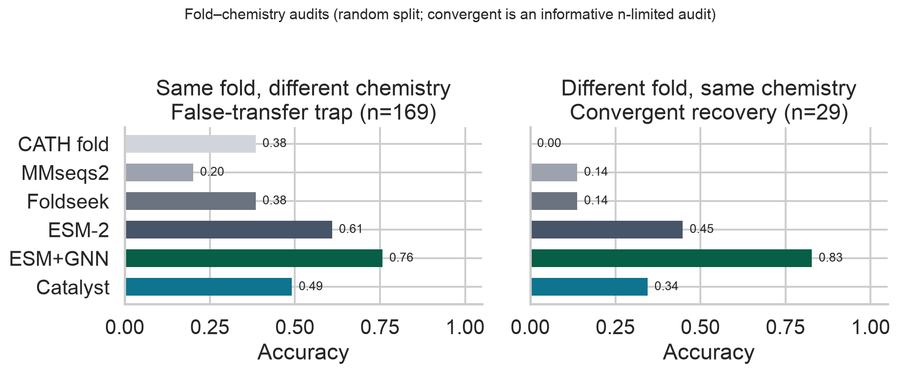
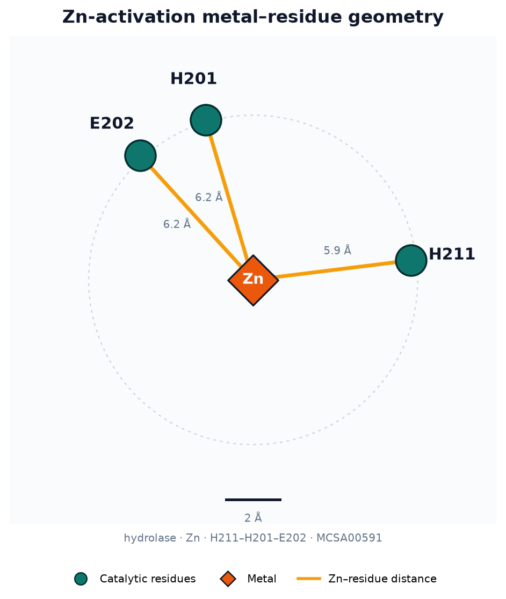

# Catalyst Atlas

**AI-guided redesign of catalytic microenvironments**

*Generative protein design constrained by mechanistic chemistry.*

> Catalytic function is encoded not only by global fold but by local geometric and chemical environments that can be computationally optimized.

[](https://github.com/snowe36/catalyst_atlas/actions/workflows/ci.yml)
[](LICENSE)


Repo: [github.com/snowe36/catalyst_atlas](https://github.com/snowe36/catalyst_atlas)

---

## The question

**Can generative models optimize the molecular environment surrounding known catalytic machinery?**

Many protein design workflows optimize global stability or binding. This project focuses on a complementary problem: preserving chemically precise local environments where catalytic function emerges — catalytic residues fixed, first-/second-shell positions redesigned, then ranked with structure confidence, sequence plausibility, and catalytic geometry constraints.

This is not a claim that AI invented a new enzyme. Experimental validation remains required. Proxies ≠ measured catalysis.

---

## Workflow

```text
M-CSA catalytic sites
        │
        ▼
 Pocket extraction (fixed catalysts + redesignable shell)
        │
        ▼
 Generative model (ProteinMPNN today — swappable)
        │   proposal engine, not an oracle
        ▼
 Chemistry filters (hard invariants + ESM + fixed-backbone chemistry)
        │
        ▼
 ColabFold / AF2 (shortlist only)
        │
        ▼
 Catalytic scoring (geometry · structure · ESM vs WT)
        │
        ▼
 Ranked, experimentally sized candidate set
```

The durable piece is a **mechanistically constrained evaluation framework** for generative enzyme design: ProteinMPNN today, replaceable tomorrow (Chai / Evo / ESM-IF / RFdiffusion). The evaluator stays useful.

| Piece | Role |
|-------|------|
| Pocket artifact | Catalytic (fixed) + redesignable shell with chain/resnum/aa/xyz |
| Generator | ProteinMPNN adapter (or mock / FASTA import) — swappable proposal engine |
| Evaluation | AF metrics + ESM neighborhood + catalytic geometry proxies |
| Score | `chemistry_constraint_score` = 0.4 geometry + 0.3 structure + 0.3 ESM |

Hard invariants: designed sequence matches WT at catalytic indices; every mutation lies in the redesignable set.

---

## Real campaign results

**8** M-CSA enzymes · ProteinMPNN shell redesign · chemistry-constrained funnel · ColabFold on the shortlist only.

| Check | Result |
|-------|--------|
| Panel | **8** enzymes (metalloprotease / redox / transferase / cofactor / other) |
| Generated → hard-pass → AF | **779 → 771 → 80** designs (+ **8** WT = **88** structures) |
| Score | `0.4·geometry + 0.3·structure + 0.3·ESM` vs WT |
| Mean design score / Δ vs WT | **0.943** / **−0.045** |
| Geometry (design AF vs WT AF) | mean **0.931** (std **0.035**) — axis informative |
| Invariants | **80/80** catalytic identity + shell-only mutations |
| Cheap↔AF top-3 overlap | **~0.50** |
| MSA strategy | `reuse_wt` (WT MSA → design A3Ms) |

Cheap↔AF top-3 overlap **~0.50** indicates that inexpensive chemistry-aware filters recover many of the same candidates selected after expensive structure prediction, reducing the number of AF evaluations required.

Top designs sit **slightly below WT** on the composite proxy — the expected outcome for a preservation-first funnel (proxies ≠ beating evolution). Full writeup: [`out/design_case_study.md`](out/design_case_study.md).

<p align="center">
  
</p>

<p align="center"><em>Figure D1. Fixed catalytic core vs redesignable first-/second-shell positions.</em></p>

<p align="center">
  
</p>

<p align="center"><em>Figure D2. Design landscape — geometry vs ESM plausibility; WT, shortlisted, and rejected candidates.</em></p>

<p align="center">
  
</p>

<p align="center"><em>Figure D3. Designs scored relative to a WT AF geometry baseline.</em></p>

<p align="center">
  
</p>

<p align="center"><em>Figure D4. Ranking axes (ESM vs geometry; color = structure confidence).</em></p>

### Design assumptions

- catalytic residues define the invariant chemical core
- first-/second-shell residues encode tunable aspects of the catalytic environment
- sequence plausibility and structural confidence are necessary but insufficient filters
- experimental validation remains required

CPU smoke: `cat-design-run --mock`. Real AF path: ProteinMPNN → `cat-design-funnel` → ColabFold on `af_queue.fasta` → `cat-design-score --af-queue-only --backfill-af-geometry`.

---

## What this repo builds

1. **Curate** M-CSA catalytic sites with structures, cofactors, and chemistry labels
2. **Define** pocket artifacts (fixed catalysts + redesignable shells)
3. **Generate** shell-only sequence designs (ProteinMPNN or import)
4. **Score** designs vs WT with AF / ESM / catalytic geometry proxies
5. **Validate** learned catalytic representations under leakage-aware holdouts (below)

---

## Supporting representation benchmark

Evolutionary similarity is a strong proxy for function when homologs exist. This supporting benchmark asks what remains when they do not — chemistry identification from the reaction center under sequence/fold holdouts — evidence that the same microenvironment features motivating the design filters carry chemistry signal beyond fold.

Primary metric: `fold_cluster` chemistry accuracy on the expanded atlas (**n=1157**; M-CSA 959 + UniProt 198).

Multi-seed bake-off (seeds 7 / 11 / 13):

| Method | fold_cluster (mean ± std) |
|--------|--------------------------:|
| Engineered microenvironment | 0.40 ± 0.02 |
| ESM-2 | 0.40 ± 0.06 |
| ESM+GNN | 0.42 ± 0.06 |

Neighborhood baselines (seed 7): MMseqs2 0.04, Foldseek 0.13. Random-graph ablation: geometry-specific gains are **not yet established**. Sources: [`out/v05_seed_summary.json`](out/v05_seed_summary.json), [`out/v05_ablation_summary.json`](out/v05_ablation_summary.json).

<p align="center">
  
</p>

### Convergent chemistry (representation evidence)

| | Thermolysin `MCSA00176` | Neprilysin `MCSA00623` |
|--|-------------------------|-------------------------|
| Sequence neighborhood | remote (~5–7% k-mer Jaccard) | remote |
| Fold / CATH | `1.10.390` | `3.40.390` |
| Reaction chemistry | hydrolysis / metal activation | hydrolysis / metal activation |

Full writeup: [`out/hero_convergent_chemistry.md`](out/hero_convergent_chemistry.md).

<p align="center">
  
</p>

<p align="center"><em>Representation pipeline used to validate catalytic microenvironment features.</em></p>

### Example output

```bash
cat-search --enzyme-id MCSA00176
```

```text
Catalyst Atlas
==============

Chemistry: hydrolysis (metal activation)
Confidence: 0.82

Evidence:
  - catalytic residue pattern: His-Glu-Asp-Arg
  - mechanistic pattern: metal activation
  - Zn cofactor/metal at reaction center
  - analogs span multiple fold neighborhoods

Nearest analogs:
  1. MCSA00623 — hydrolysis / metal activation (cof=Zn; different fold)
  2. MCSA00159 — hydrolysis / metal activation (cof=Zn; different fold)
  ...
```

The artifact is **prediction + why** — chemistry family, mechanistic pattern, and catalytic evidence — not `score = 0.82`.

---

## Key results

| Check | Result |
|-------|--------|
| Shell redesign (real AF) | **8** enzymes · **779→80** funnel · **88** ColabFold structures · mean Δ vs WT **−0.045** |
| Expanded atlas sites (M-CSA + UniProt) | **1157** |
| Fold-disconnected Catalyst / MMseqs / Foldseek | **0.37** / 0.04 / 0.13 |
| Chemistry Recall@5 (fold_cluster) | **0.67** |
| Chemistry MRR (fold_cluster) | **0.46** |
| MMseqs2 at nearest-train identity **<20%** | **0.00** |
| Different-fold / same-chemistry | Catalyst **0.50** vs Foldseek **0.04** — **informative audit, n=26** |
| Same-fold / different-chemistry | Foldseek **0.51** vs Catalyst 0.39 (**n=131**) — fold info is legitimately useful |

> **Key observation:** when enzymes share chemistry but not fold, standard sequence/structure retrieval can fail; interpretable reaction-center representations provide a complementary signal.

The fold-disconnected benchmark (**n=461** test) carries the quantitative claim. The convergent-chemistry subset (**n=26**) is a biologically informative hard audit — not the primary win metric. Do not oversell it.

Full writeup: [`out/mcsa_v02_n959_results.md`](out/mcsa_v02_n959_results.md).

---

## Quick start

Requires **Python 3.11+**:

```bash
git clone https://github.com/snowe36/catalyst_atlas.git && cd catalyst_atlas
python3.11 -m venv .venv && source .venv/bin/activate
pip install -U pip && pip install -e ".[dev]"
bash scripts/reproduce.sh && pytest -q
```

```text
# Redesign case study
#   mock smoke: cat-download --demo && cat-design-run --mock
#   real AF:    cat-design-score --af-queue-only --backfill-af-geometry

# Representation validation track
cat-download → cat-enrich → cat-sites → cat-embed → cat-eval → cat-cases → cat-figures
```

Optional: **MMseqs2** / **Foldseek** on `PATH` for retrieval baselines; ProteinMPNN / ColabFold externally for real designs (export `mpnn_jobs/`, funnel to `af_queue.fasta`, then `cat-design-score --af-queue-only --backfill-af-geometry`).

---

## Figure 2 — Chemistry transfer under evolutionary distance

At high identity, sequence is the right tool. At remote homology, sequence transfer becomes unreliable; the catalytic environment retains chemically relevant signal.

| Nearest train identity | n | Catalyst | MMseqs2 | Foldseek |
|------------------------|--:|---------:|--------:|---------:|
| >80% | 3 | 0.67 | 0.33 | 0.67 |
| 40–80% | 14 | 0.50 | **0.86** | 0.71 |
| 20–40% | 61 | 0.56 | 0.64 | **0.67** |
| <20% | 154 | **0.45** | 0.00 | 0.27 |

<p align="center">
  
</p>

<p align="center"><em>Figure 2. Expanded atlas (n=1157, random split). MMseqs2 is strong in the mid-identity band and collapses below 20%; engineered microenvironments keep signal when homologs are gone. High-identity bins are small-n.</em></p>

Leakage-aware splits (expanded atlas):

| Split | Catalyst | ESM-2 | ESM+GNN | MMseqs2 | Foldseek |
|-------|---------:|------:|--------:|--------:|---------:|
| Random | 0.48 | 0.60 | **0.79** | 0.22 | 0.41 |
| Seq cluster | 0.45 | 0.59 | **0.77** | 0.22 | 0.40 |
| Fold cluster (seed 7) | 0.38 | 0.46 | **0.49** | 0.04 | 0.13 |

Fold-cluster numbers above are the seed-7 run. Multi-seed means: engineered 0.40 ± 0.02, ESM-2 0.40 ± 0.06, ESM+GNN 0.42 ± 0.06.

Recall@5 / MRR ask: does the true chemistry appear among retrieved catalytic neighbors? Accuracy alone understates a retrieval system.

---

## Figure 3 — Fold and chemistry are separable

| Panel | Question | n | Catalyst | Foldseek | MMseqs2 |
|-------|----------|--:|---------:|---------:|--------:|
| **A** Same fold, different chemistry | Avoid false functional transfer? | 131 | 0.39 | **0.51** | 0.26 |
| **B** Different fold, same chemistry | Recognize convergent chemistry? | **26** | **0.50** | 0.04 | 0.08 |

<p align="center">
  
</p>

<p align="center"><em>Figure 3. Panel A: fold information is legitimately useful — leave it visible. Panel B (n=26): chemistry can be conserved despite different evolutionary solutions.</em></p>

---

## Figure 4 — Evidence cards

The practical output is a **chemistry card**: family, mechanistic pattern, catalytic evidence, and nearest chemical analogs — not just a leaderboard number.

<p align="center">
  
</p>

<p align="center"><em>Figure 4. Prediction + mechanistic evidence — the thing a scientist would actually use.</em></p>

Narrative case studies: `cat-cases` → [`out/case_studies/`](out/case_studies/).

---

## Catalytic microenvironment

| Component | Detail |
|-----------|--------|
| Source | [M-CSA](https://www.ebi.ac.uk/thornton-srv/m-csa/) + [RCSB PDB](https://www.rcsb.org/) |
| Catalytic residues | Annotated chemistry-participating amino acids |
| Geometry | Pairwise distances among catalytic atoms |
| Cofactors / metals | HETATM within ~8 Å of the catalytic core |
| First shell | Neighboring residues around the site |
| Labels | `chemistry_family` + `mechanistic_pattern` |

<p align="center">
  
</p>

<p align="center"><em>Zn-activation reaction center — a local chemical machine, not a fold fingerprint.</em></p>

---

## Data

| Item | Detail |
|------|--------|
| M-CSA curated sites | **959** |
| Additional UniProt ACT_SITE sites | **198** |
| Expanded atlas sites | **1157** |
| Structures | [RCSB PDB](https://www.rcsb.org/) + AFDB (`structure_source=alphafold` where used) |
| With site cofactors / metals (M-CSA track) | **324** |
| Convergent-chemistry audit subset | **26–29** (hard; informative, not large) |
| Demo atlas | CI harness (`cat-download --demo`) |

---

## Limitations

- Design case study reports a **real** ProteinMPNN + ColabFold campaign on 8 enzymes (88 structures); CPU `--mock` remains for CI smoke only — proxies ≠ measured catalysis
- Score axes are **proxies** (AF catalytic geometry vs WT AF / pLDDT / ESM plausibility) — `chemistry_constraint_score` ranks constraint satisfaction, not proven chemistry preservation
- Redesign panel is small (**8** enzymes), not a full-atlas ProteinMPNN campaign; **no MD** in this repo
- Expanded atlas is still curated-scale (n=1157), not proteome-wide
- Fold-cluster scores are **split-sensitive** (ESM-2 and ESM+GNN both move ±0.06 across three seeds)
- Random-graph ablation: geometry-specific gains are **not yet established** (shuffled nodes ≥ catalytic graphs on seed 7)
- Convergent-chemistry audit is small (**n≈26–29**) — useful, not decisive
- Labels are ontology families / patterns, not full kinetic schemes
- Chemistry cards cite pattern / cofactor / fold-span evidence — not full mechanistic checklists

---

## Conclusions

This project demonstrates an end-to-end workflow for mechanistically constrained enzyme redesign. Starting from curated catalytic sites, the pipeline generates shell-only sequence variants, prioritizes candidates using inexpensive chemistry-aware filters, and reserves expensive structure prediction for a small shortlist. In a real ProteinMPNN + ColabFold campaign spanning eight enzymes, the workflow reduced 779 generated variants to 80 evaluated structures while preserving catalytic identity and near–wild-type catalytic geometry. The contribution is the design framework and evaluation strategy rather than claims of improved enzymatic activity.

---

## How to reproduce

```bash
git clone https://github.com/snowe36/catalyst_atlas.git
cd catalyst_atlas
python3.11 -m venv .venv && source .venv/bin/activate
pip install -U pip && pip install -e ".[dev]"
bash scripts/reproduce.sh
pytest -q
```

Real curated sites:

```bash
cat-download --public --n-enzymes 1000
cat-enrich
cat-sites && cat-embed && cat-eval
cat-cases && cat-figures
cat-search --enzyme-id MCSA00176
```

Representation / control CLIs (optional):

| Step | Command |
|------|---------|
| Reaction-center graphs | `cat-graphs` |
| Frozen ESM-2 | `cat-esm` |
| ESM + GNN fusion | `cat-train-encoder --fusion-esm` |
| Annotation controls | `cat-eval` |
| Expanded atlas | `cat-download --public --expanded` |
| Multi-seed bake-off | `scripts/v05_seed_bakeoff.py` |
| Random-graph ablation | `scripts/v05_ablation_run.py` |

Out of scope: full-atlas ProteinMPNN, new generative model training, generator bake-offs, wet-lab validation claims.

| Artifact | Path |
|----------|------|
| Design case study | `out/design_case_study.md` |
| Design pocket map | `out/figures/fig_design_pocket_map.png` |
| Design landscape | `out/figures/fig_design_landscape.png` |
| Design geometry vs WT | `out/figures/fig_design_geometry_vs_wt.png` |
| Design score scatter | `out/figures/fig_design_score_scatter.png` |
| Fig 1 representation pipeline | `out/figures/fig1_pipeline.png` |
| Fig 2 identity stratification | `out/figures/fig_chemistry_by_seq_identity.png` |
| Fig 3 fold–chemistry audits | `out/figures/fig_fold_chemistry_audits.png` |
| Fig 4 chemistry cards | `out/figures/fig4_chemistry_cards.png` |
| Convergent case study | `out/hero_convergent_chemistry.md` |
| Seed / ablation summaries | `out/v05_seed_summary.json`, `out/v05_ablation_summary.json` |

---

## Project layout

```text
src/catalyst_atlas/
  design/             pocket, panel, generate, mpnn, predict, score, report
  data/ site/ featurize/ models/ eval/ explain/ viz/
scripts/              reproduce.sh, embed_esm.py, runpod_train.sh
data/processed/design/ pockets, designs, scores, mpnn_jobs
out/              design_case_study.md + figures + eval summaries
tests/                unit + design invariants + pipeline smoke
```

---

## Acknowledgments

Catalytic site annotations from [M-CSA](https://www.ebi.ac.uk/thornton-srv/m-csa/) (EMBL-EBI / Thornton group). Structures from the [RCSB PDB](https://www.rcsb.org/).

---

## AI Assistance

Development of this repository was assisted by Cursor (AI-powered code editor) for code generation, refactoring, documentation, and routine implementation tasks. All scientific design, algorithmic decisions, validation, testing, and final code review were performed by the author.

---

## License

MIT
