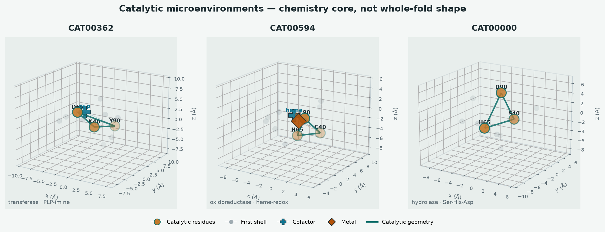
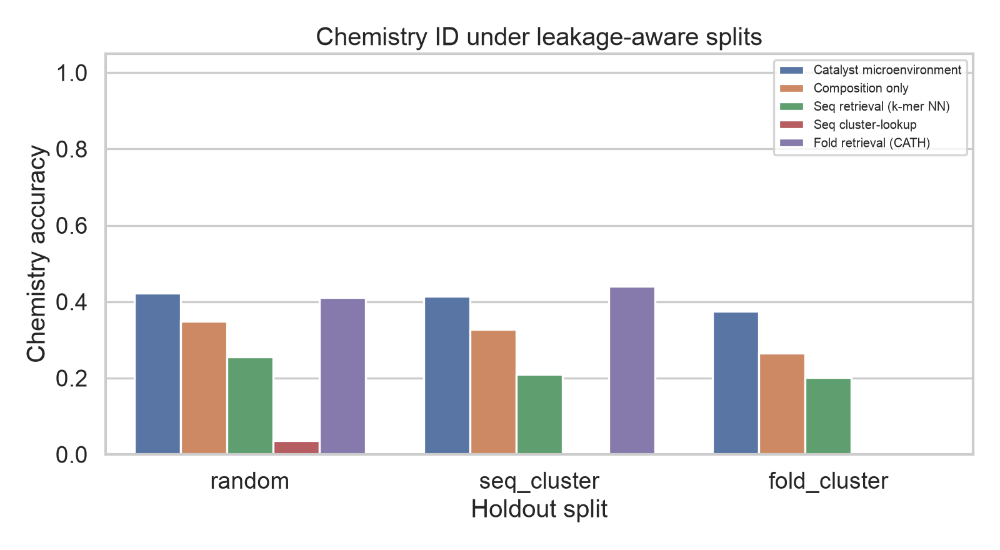
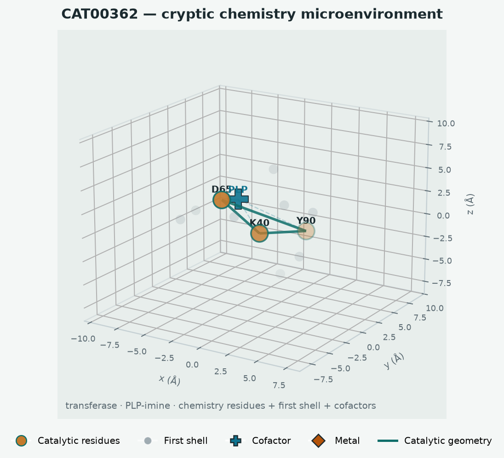

# catalyst_atlas

**A leakage-aware benchmark for chemistry identification from catalytic microenvironments** — ask what reaction a protein site can run from its chemistry-aware reaction center, then stress-test whether that signal survives when sequence and fold neighbors are held out.

[](https://github.com/snowe36/catalyst_atlas/actions/workflows/ci.yml)
[](LICENSE)


Repo: [github.com/snowe36/catalyst_atlas](https://github.com/snowe36/catalyst_atlas)

---

## The problem

Sequence and structure retrieval make enzyme annotation look easy: find a homolog, transfer its chemistry. The harder question is:

**Can we identify what chemistry a protein can perform from its catalytic microenvironment — and how much of that apparent skill is really evolutionary neighborhood leakage rather than chemistry-aware signal?**

This is an evaluation-hygiene / representation problem with explicit negative controls (sequence-cluster and fold-cluster holdouts). The claim is **not** “we beat Foldseek.” Foldseek is excellent when fold neighbors are available. The experiment asks what remains when they are not.

---

## What this repo builds

1. **Download & curate** M-CSA catalytic sites with RCSB coordinates
2. **Enrich** cofactors / metals near the site and assign a chemistry ontology (`chemistry_family`, `mechanistic_pattern`)
3. **Extract** catalytic microenvironments (residues, geometry, cofactors, first-shell neighbors)
4. **Embed & retrieve** with engineered chemistry-aware features (no deep model required)
5. **Benchmark** chemistry transfer under random, seq-cluster, and fold-cluster splits against MMseqs2 / Foldseek / CATH baselines
6. **Explain** with chemistry cards and three curated case studies

<p align="center">
  
</p>

<p align="center"><em>Hero figure. When homologous folds are unavailable, catalytic microenvironment representations preserve chemistry information — that gap <strong>is</strong> the finding.</em></p>

---

## Key results

| Check | Result |
|-------|--------|
| Curated catalytic sites (M-CSA v1) | **959** with PDB coordinates |
| Sites with nearby cofactors / metals | **324 / 959** |
| Fold-disconnected Catalyst accuracy | **0.37** |
| Fold-disconnected MMseqs2 / Foldseek | **0.04** / **0.13** |
| Random-split Foldseek accuracy (optimistic) | **0.50** (as expected — fold neighbors carry chemistry) |
| MMseqs2 at nearest-train identity **<20%** | **0.00** (collapses) |
| Different-fold / same-chemistry recovery (Catalyst) | **0.50** vs Foldseek **0.04** |
| Does Catalyst beat Foldseek on random / seq holdouts? | **No** — and that is left visible on purpose |
| Is the representation just recovering fold? | **No** — fold_cluster + convergent-chemistry audits |

Full writeup: [`reports/mcsa_v02_n959_results.md`](reports/mcsa_v02_n959_results.md).

---

## Quick start

Requires **Python 3.11+**:

```bash
git clone https://github.com/snowe36/catalyst_atlas.git && cd catalyst_atlas
python3.11 -m venv .venv && source .venv/bin/activate
pip install -U pip && pip install -e ".[dev]"
bash scripts/reproduce.sh && pytest -q
```

Synthetic / CI pipeline:

```text
cat-download --demo → cat-sites → cat-embed → cat-eval → cat-search → cat-figures
```

Real M-CSA path (network + PDB cache):

```text
cat-download --public → cat-enrich → cat-sites → cat-embed → cat-eval → cat-cases
```

Optional: install **MMseqs2** / **Foldseek** (or use vendored builds under `tools/`) for live sequence/structure retrieval baselines.

---

## Catalytic microenvironment

The representation is the **chemistry-aware reaction center**, not whole-protein fold similarity or pocket shape alone:

| Component | Detail |
|-----------|--------|
| Source | [M-CSA](https://www.ebi.ac.uk/thornton-srv/m-csa/) curated catalytic sites + [RCSB](https://www.rcsb.org/) PDB |
| Catalytic residues | Annotated chemistry-participating amino acids |
| Geometry | Pairwise distances among catalytic atoms |
| Cofactors / metals | HETATM within ~8 Å of the catalytic core |
| First shell | Neighboring residues around the site |
| Ligand contacts | When present in the structure |
| Labels | `chemistry_family` + `mechanistic_pattern` (enzymologist language, not EC-digit spam) |

Ontology examples: hydrolysis, oxidation-reduction, transfer, carbon-carbon chemistry, ligation, isomerization, elimination; metal activation, nucleophile attack, acid/base, covalent intermediate, radical, hydride transfer, imine chemistry.

<p align="center">
  
</p>

<p align="center"><em>Catalytic microenvironments — residues, cofactors, and local geometry that define the chemical machine.</em></p>

---

## Leakage-aware chemistry transfer

**Primary task:** transfer `chemistry_family` from catalytic neighbors under leakage-aware splits.

**Baselines:** Catalyst microenvironment kNN · composition-only ablation · k-mer sequence NN · CATH fold cluster-lookup · **MMseqs2** / **Foldseek** when installed.

**Splits (the point of the repo):**

| Split | What it tests |
|-------|----------------|
| Random | Optimistic ceiling (evolutionary neighbors allowed) |
| Seq cluster | Chemistry ID when sequence neighborhoods are held out |
| Fold cluster | Chemistry ID when fold neighborhoods are held out — **primary claim** |

M-CSA n=959 chemistry-family accuracy:

| Split | Catalyst | MMseqs2 | Foldseek | Seq (k-mer) | Fold (CATH) |
|-------|---------:|--------:|---------:|------------:|------------:|
| Random | 0.42 | 0.29 | **0.50** | 0.26 | 0.41 |
| Seq cluster | 0.42 | 0.23 | **0.49** | 0.21 | 0.44 |
| Fold cluster | **0.37** | 0.04 | 0.13 | 0.20 | 0.00 |

<p align="center">
  
</p>

<p align="center"><em>Leakage-aware chemistry ID — Foldseek leads when fold neighbors exist; Catalyst retains signal on the fold-disconnected holdout where retrieval collapses.</em></p>

**Takeaway:** sequence and structure tell you evolutionary relationships. Catalyst Atlas tries to recover chemical capability. Foldseek dominating on random / seq_cluster validates the framework; fold_cluster is where the complementary claim lives.

### Chemistry transfer vs evolutionary distance

Stratify the random-split test set by nearest-train MMseqs2 `%id`:

| Nearest train identity | n | Catalyst | MMseqs2 | Foldseek |
|------------------------|--:|---------:|--------:|---------:|
| >80% | 2 | 0.50 | **1.00** | 0.00 |
| 40–80% | 16 | 0.62 | 0.69 | **0.75** |
| 20–40% | 60 | 0.50 | **0.70** | 0.68 |
| <20% | 114 | 0.35 | **0.00** | 0.38 |

<p align="center">
  
</p>

<p align="center"><em>MMseqs2 dominates near homologs and collapses below 20% identity; Catalyst retains chemistry signal when sequence neighborhoods disappear.</em></p>

### Fold–chemistry relationship audits

| Audit | Question | n | Catalyst | Foldseek | MMseqs2 |
|-------|----------|--:|---------:|---------:|--------:|
| Same fold, different chemistry | Avoid false functional transfer? | 131 | 0.39 | **0.51** | 0.26 |
| Different fold, same chemistry | Recognize convergent chemistry? | 26 | **0.50** | 0.04 | 0.08 |

<p align="center">
  
</p>

<p align="center"><em>Foldseek still helps when a shared fold is available; Catalyst is the method that recovers chemistry across folds.</em></p>

Full metrics: [`data/processed/eval_metrics.json`](data/processed/eval_metrics.json).

---

## Case studies & interpretation

Three narrative cards — generated with `cat-cases` → [`reports/case_studies/`](reports/case_studies/):

| Case | Question |
|------|----------|
| Same fold, different chemistry | Can Catalyst avoid false functional transfer? |
| Different fold, same chemistry | Can it recognize convergent chemistry? |
| Cofactor-aware hypothesis | Does metal/cofactor context change the chemistry card? |

<p align="center">
  
</p>

<p align="center"><em>Example microenvironment used in the cryptic-chemistry / case-study narrative.</em></p>

Chemistry cards (`cat-search`) surface predicted family, pattern, cofactors, and evidence neighbors — inspectable retrieval, not a black-box EC classifier.

---

## Data

| Item | Detail |
|------|--------|
| Source | [M-CSA](https://www.ebi.ac.uk/thornton-srv/m-csa/) catalytic site annotations |
| Structures | [RCSB PDB](https://www.rcsb.org/) (cached under `data/raw/mcsa_cache/pdb`) |
| Enzymes / sites | **959** |
| With site cofactors / metals | **324** |
| Chemistry families | 7 (`chemistry_family`) |
| Demo atlas | Synthetic harness for CI / offline (`cat-download --demo`) |

---

## Limitations

- M-CSA is curated and relatively small; results are not a proteome-scale claim
- Labels are ontology families / patterns, not full mechanistic schemes or kinetic constants
- Foldseek / MMseqs transfer quality depends on binary availability and hit-table thresholds
- Composition-only ablation still carries some chemistry-residue signal — not a pure negative control
- Deep models are intentionally deferred; this repo establishes the engineered baseline first

---

## Future directions

- Richer cofactor geometry (coordination shell, not just presence)
- Larger remote-homology bins (more enzymes with true BLAST/MMseqs %id coverage)
- Learned representations **only if** they beat this baseline on fold-disconnected holdouts

Done in v0.2: cofactor/metal enrichment · chemistry ontology · live MMseqs2/Foldseek baselines · fold-disconnected hero · sequence-identity stratification · fold–chemistry audits · three case studies · chemistry cards.

---

## How to reproduce (detail)

```bash
git clone https://github.com/snowe36/catalyst_atlas.git
cd catalyst_atlas
python3.11 -m venv .venv && source .venv/bin/activate
pip install -U pip && pip install -e ".[dev]"
bash scripts/reproduce.sh
pytest -q
```

Real curated sites:

```bash
cat-download --public --n-enzymes 1000
cat-enrich
cat-sites && cat-embed && cat-eval
cat-cases
cat-search --enzyme-id MCSA00001
```

On Apple Silicon with a Rosetta (x86_64) Python, eval wraps MMseqs/Foldseek with `arch -arm64` so those binaries do not hang under translation.

| Artifact | Path |
|----------|------|
| Hero (fold-disconnected) | `reports/figures/fig_fold_disconnected_chemistry.png` |
| Leakage bar chart | `reports/figures/fig_chemistry_leakage.png` |
| Identity stratification | `reports/figures/fig_chemistry_by_seq_identity.png` |
| Fold–chemistry audits | `reports/figures/fig_fold_chemistry_audits.png` |
| Microenvironment gallery | `reports/figures/fig_microenv_gallery.png` |
| Case studies | `reports/case_studies/` |
| Metrics | `data/processed/eval_metrics.json` |
| Hit caches | `data/processed/mmseqs_hits.tsv`, `foldseek_hits.tsv` |
| Results writeup | `reports/mcsa_v02_n959_results.md` |

---

## Project layout

```text
src/catalyst_atlas/   package (data, site, featurize, models, eval, explain, viz)
scripts/              reproduce.sh
data/raw|processed/   M-CSA / PDB cache + features, embeddings, metrics
reports/figures/      leakage + microenvironment figures
reports/case_studies/ three scientific narratives
tests/                unit + pipeline smoke tests
.github/workflows/    CI (ruff + pytest)
```

---

## Acknowledgments

Catalytic site annotations from [M-CSA](https://www.ebi.ac.uk/thornton-srv/m-csa/) (EMBL-EBI / Thornton group). Structures from the [RCSB PDB](https://www.rcsb.org/). Cite M-CSA and RCSB when redistributing regenerated tables or figures.

---

## License

MIT
